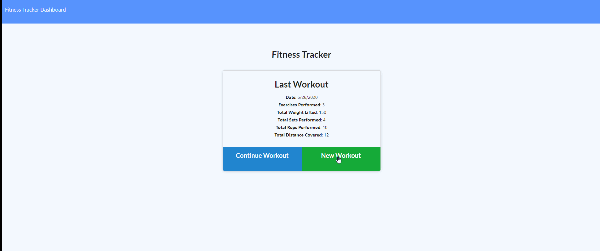

# fitness-tracker-ECB

# Unit 17 Node Express Handlebars: Eat Da Burger

For this assignment, you'll create a workout tracker. You have already been provided with the front end code in the `Develop` folder. This assignment will require you to create Mongo database with a Mongoose schema and handle routes with Express.

## Table of Contents

1. [Link](#link)
2. [Description](#description)
3. [Use](#use)
4. [Installation](#installation)
5. [Contributing](#contributing)
6. [Questions](#questions)
7. [Example](#example)

### Link

The link to the heroku app for this repo is:

```
https://fitness-tracker-ecb.herokuapp.com/
```

### Description

The application will be invoked with the following command:

```sh
node server.js
```

The user will be told what port the app is being served on and can go to localhost: in the web browser.

### Use

As a user, I want to be able to view create and track daily workouts. I want to be able to log multiple exercises in a workout on a given day. I should also be able to track the name, type, weight, sets, reps, and duration of exercise. If the exercise is a cardio exercise, I should be able to track my distance traveled.

### Installation

Please run npm install to handle dependencies.

### Contributing

Contributions to this project are welcome.

### Questions

If you have an questions about the repo, open an issue or contact Elly Burgess directly at Eleanor.C.Burgess@gmail.com.

### Example


